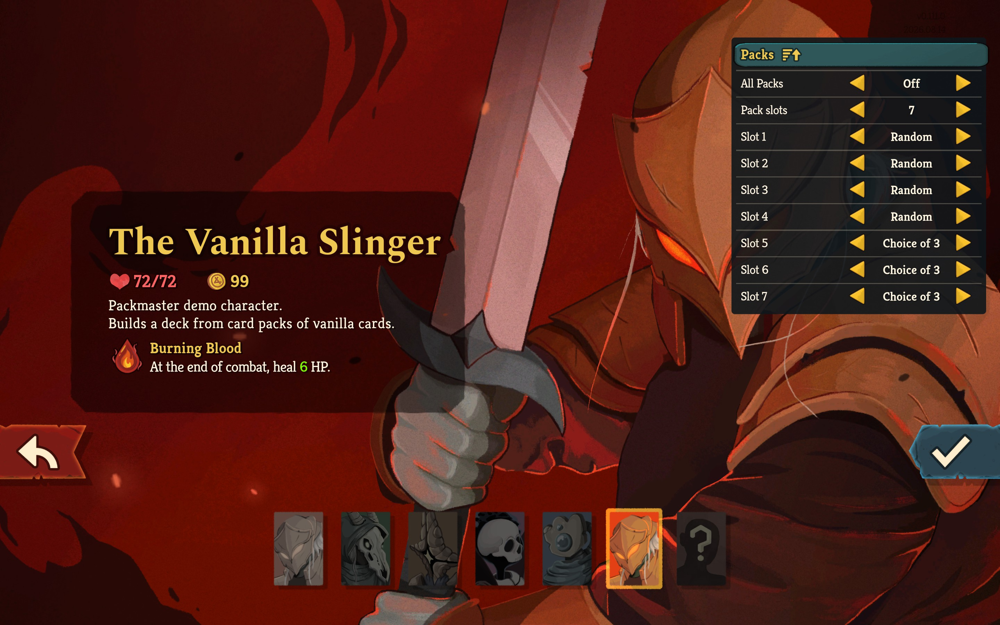
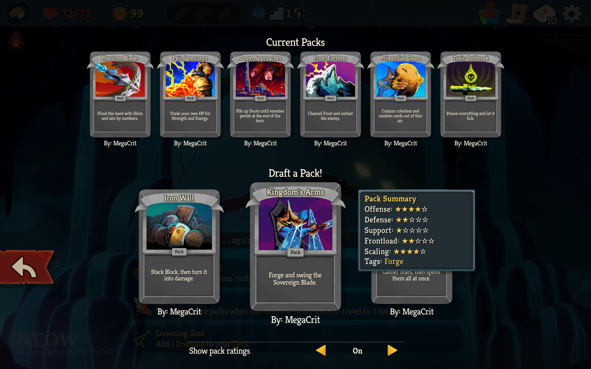
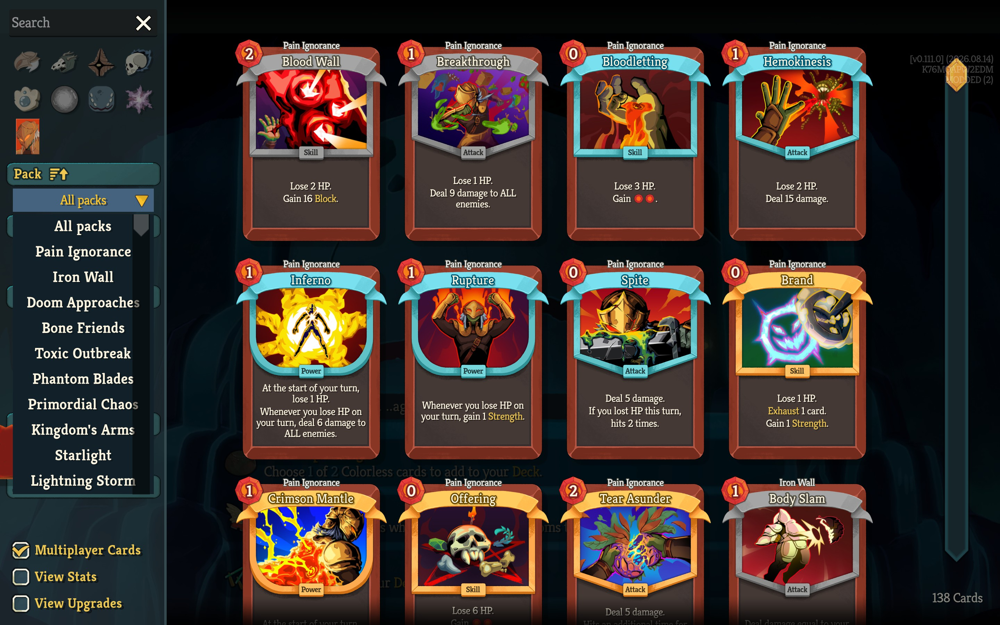
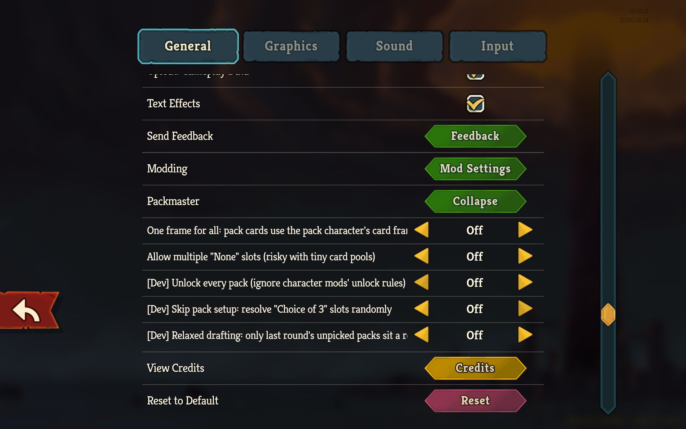
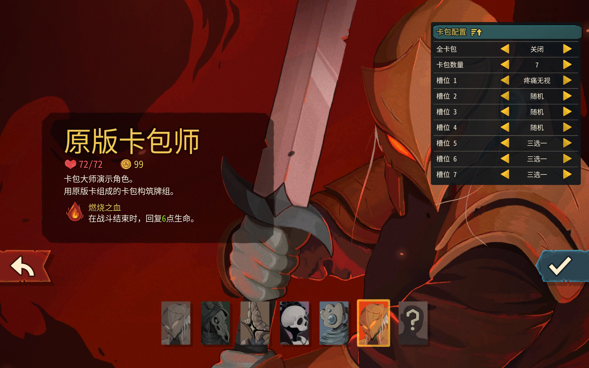
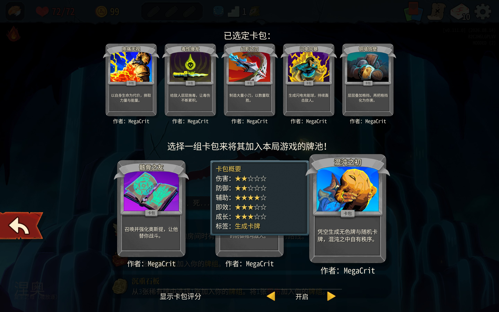
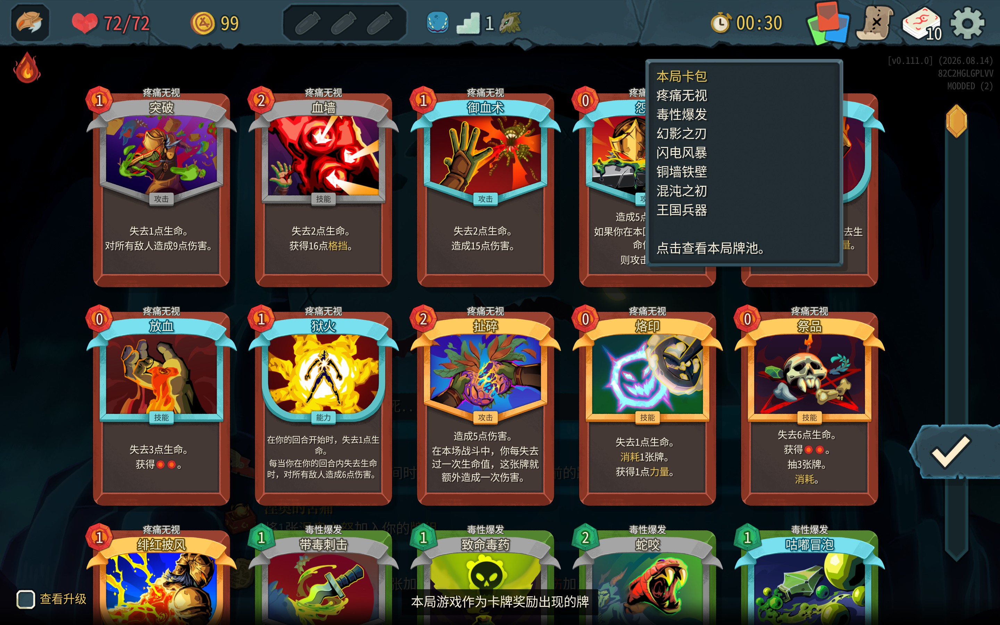
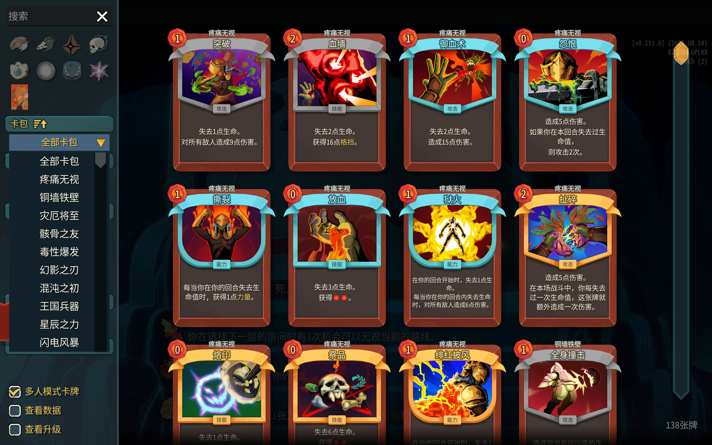
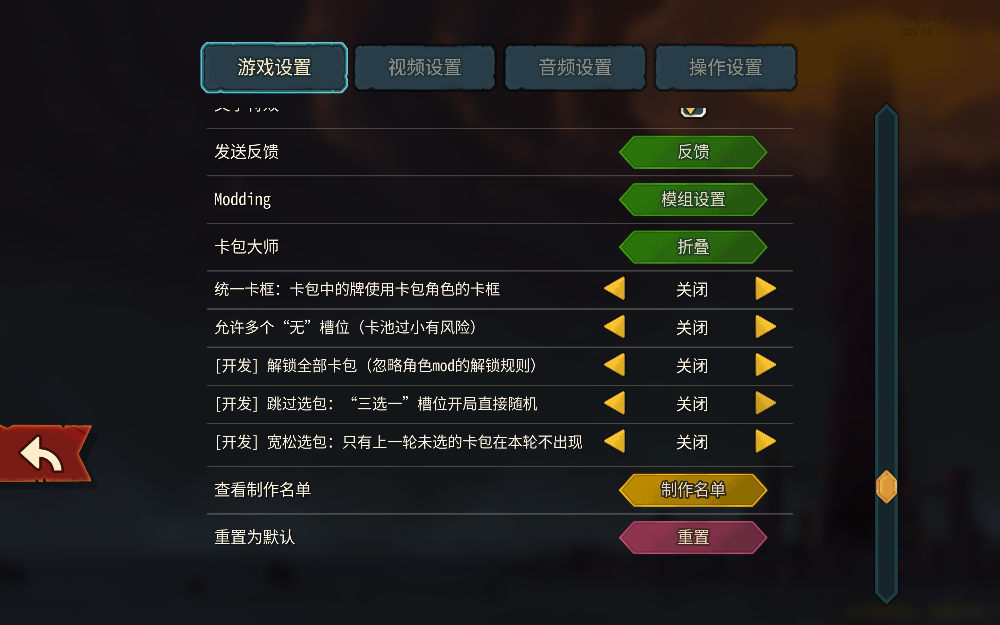

# Packmaster for Slay the Spire 2

[English](#english) | [中文](#中文)

## English

A **Slay the Spire 2** mod library that brings the core of STS1's *The Packmaster* to STS2: card-pack
characters whose card pool is assembled from packs drafted at the start of each run.
It uses only the game's modding API and Harmony — no other dependencies.

| Mod | Folder | Purpose |
|---|---|---|
| **PackmasterLib** | [`PackmasterLib/`](PackmasterLib) | The library. Pack registration API, character-select pack config, start-of-run pack draft, pack-based card pool, pack names on cards, top-bar packs button, card library pack sort/filter, settings, save data. UI in all 16 game languages. Does nothing on its own. |
| **VanillaPacks** | [`VanillaPacks/`](VanillaPacks) | Test/demo character **The Vanilla Slinger**: 11 packs made of vanilla cards, plus an end-to-end automated test. Also the reference implementation for mod authors. |

Game version: **v0.111.0** (.NET 9).

### Features



- **Pack config on character select**: All Packs mode, 3–10 slots, each Random / Choice of 3 / None / a specific pack; saved per character.
- **Pack draft before Neow** (STS1 setup screen): current packs on top, choice of 3 below, pack summary with star ratings and tags on hover, author under each pack. Back/Esc hides the screen to look at Neow or the map; save & quit before confirming is allowed. Neow's rewards are untouched.



- **Pack card pool**: rewards, shops, events, potions, "random card" effects and transforms only use the run's packs.
- **Pack names on cards**, on the top edge of the card frame. Vanilla cards keep their frame unless *One frame for all* is on.
- **Top-bar packs button**: lists the run's packs; click to view the run's card pool.


- **Card library**: pack sort button, pack filter dropdown and search by pack name for pack characters.



- **Settings → General → Packmaster**: One frame for all, multiple "None" slots, and developer options (unlock every pack, skip the draft, relaxed drafting).



### For mod authors

Read the documentation in [`docs/en/`](docs/en):

- [Getting started](docs/en/getting-started.md) — project setup, character, card pool, packs, localization, pack design rules.
- [API reference](docs/en/api.md) — every registration option, drawing API, settings and queries.
- [In-game behavior](docs/en/behavior.md) — config, draft rules, card pool, UI, saves, multiplayer, testing.

Minimal registration:

```csharp
[ModInitializer(nameof(Init))]
public static class MyEntry
{
    public static PackCharacterRegistration? Registration { get; private set; }

    public static void Init()
    {
        Registration = new PackCharacterRegistration
        {
            CharacterType = typeof(MyCharacter),
            Packs = new[]
            {
                new PackDefinition
                {
                    Id = "my_pack",
                    NameKey = "cards:MY_PACK_PREVIEW.title",
                    DescriptionKey = "cards:MY_PACK_PREVIEW.description",
                    Author = "Me",
                    CardTypes = new[] { typeof(MyCard), typeof(Bloodletting) /* vanilla cards work too */ },
                    PreviewCardType = typeof(MyPackPreview),
                    Summary = new PackSummary { Offense = 4, Defense = 2, Support = 1, Frontload = 3, Scaling = 4,
                                                Tags = new[] { PackTags.Strength } },
                },
            },
            ExtraPoolCardTypes = new[] { typeof(MyStrike), typeof(MyDefend), typeof(MyAncient) },
            DefaultSlots = new[] { "random", "random", "random", "random", "choice", "choice", "choice" },
        };
        PackmasterApi.RegisterCharacter(Registration);
    }
}
```

Each pack should have **≥ 10 cards, ≥ 2 Attacks/Skills/Powers and ≥ 2 Commons/Uncommons/Rares** — rewards and random-card effects draw only from the selected packs.

### Build

Requires the .NET 9 SDK and the game.

```
powershell -ExecutionPolicy Bypass -File build-and-install.ps1 -GameDir "<Slay the Spire 2 folder>"
```

Builds both mods and copies them into `<game>/mods/`. You can also set `STS2_DIR` (game folder) and `STS2_DOTNET` (dotnet executable), or build one project with `dotnet build -p:Sts2Dir="<game folder>"`.

### Testing

```
SlayTheSpire2.exe --headless --packmastertest --force-steam=off
```

Runs the VanillaPacks end-to-end test (muted); search the log for `PackmasterLib-AutoTest`. Console commands: `packtest resolve [seed]`, `packtest state`, `packgive <packId>`, `packtestreward [rounds]`.

### Credits

Based on the design of the Slay the Spire mod *The Packmaster*. Vanilla cards and art © Mega Crit.

---

## 中文

复刻《杀戮尖塔》1 代 *卡包大师（The Packmaster）* 核心玩法的 **杀戮尖塔2** 工具库：卡包角色的卡池由每局开始时选出的卡包组成。只使用游戏自带的 Modding API 和 Harmony，没有其他依赖。

| Mod | 目录 | 作用 |
|---|---|---|
| **PackmasterLib** | [`PackmasterLib/`](PackmasterLib) | 工具库。卡包注册 API、选人页卡包配置、开局选包、按卡包组成的卡池、卡面包名、右上角卡包按钮、图鉴卡包排序/筛选、设置页、存档。界面覆盖游戏全部 16 种语言。单独安装没有效果。 |
| **VanillaPacks** | [`VanillaPacks/`](VanillaPacks) | 测试/演示角色 **原版卡包师**：11 个由原版卡组成的卡包，以及端到端自动测试。也是给 mod 作者的参考实现。 |

游戏版本：**v0.111.0**（.NET 9）。

### 功能



- **选人页卡包配置**：全卡包模式、3–10 个槽位，每个槽位可选随机 / 三选一 / 无 / 指定卡包；按角色保存。



- **涅奥之前选包**（1 代选包界面）：上方为已选定卡包，下方三选一；悬停显示带星级和标签的卡包概要，卡下方显示作者。返回按钮/Esc 可收起界面查看涅奥或地图；确认前可以 SL。涅奥奖励不受影响。
- **卡包卡池**：奖励、商店、事件、药水、「随机一张牌」效果和变化只使用本局卡包。
- **卡面包名**：显示在卡框上边缘。原版卡保留原卡框，开启「统一卡框」后除外。



- **右上角卡包按钮**：列出本局卡包，点击查看本局牌池。



- **图鉴**：卡包角色有卡包排序按钮、卡包筛选下拉框，搜索框可搜卡包名。



- **设置 → 游戏设置 → 卡包大师**：统一卡框、允许多个「无」槽位，以及开发选项（解锁全部卡包、跳过选包、宽松选包）。

### 给 mod 作者

请阅读 [`docs/zh/`](docs/zh) 中的文档：

- [入门](docs/zh/getting-started.md)——项目配置、角色、卡池、卡包、本地化、卡包设计规则。
- [API 参考](docs/zh/api.md)——所有注册选项、抽取算法 API、设置和查询。
- [游戏内行为](docs/zh/behavior.md)——配置、候选规则、卡池、界面、存档、多人、测试。

最简注册示例见上方英文部分。每个卡包应有 **≥ 10 张牌，攻击/技能/能力各 ≥ 2，普通/罕见/稀有各 ≥ 2**——奖励和随机卡效果只从已选卡包中抽牌。

### 编译

需要 .NET 9 SDK 和游戏本体。

```
powershell -ExecutionPolicy Bypass -File build-and-install.ps1 -GameDir "<杀戮尖塔2 目录>"
```

编译两个 mod 并复制到 `<游戏目录>/mods/`。也可以设置环境变量 `STS2_DIR`（游戏目录）和 `STS2_DOTNET`（dotnet 路径），或用 `dotnet build -p:Sts2Dir="<游戏目录>"` 单独编译。

### 测试

```
SlayTheSpire2.exe --headless --packmastertest --force-steam=off
```

运行 VanillaPacks 的端到端测试（静音），在日志中搜索 `PackmasterLib-AutoTest`。控制台命令：`packtest resolve [seed]`、`packtest state`、`packgive <packId>`、`packtestreward [rounds]`。

### 致谢

基于《杀戮尖塔》1 代 mod *The Packmaster* 的设计。原版卡牌与美术 © Mega Crit。
